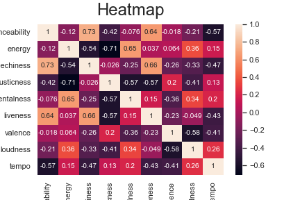
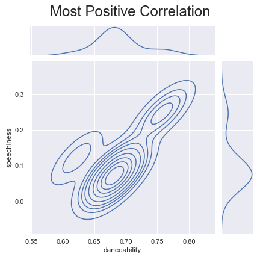
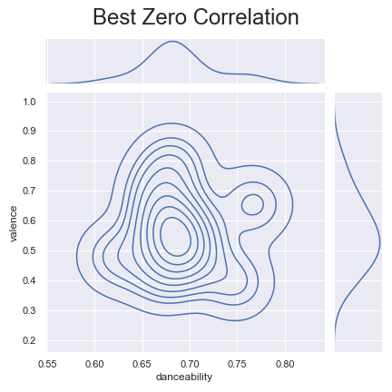
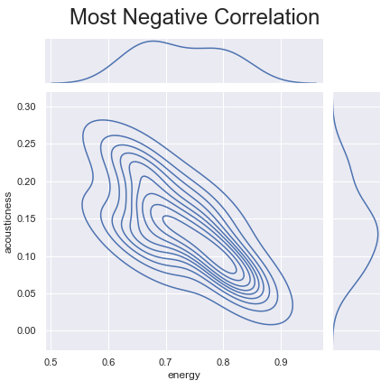
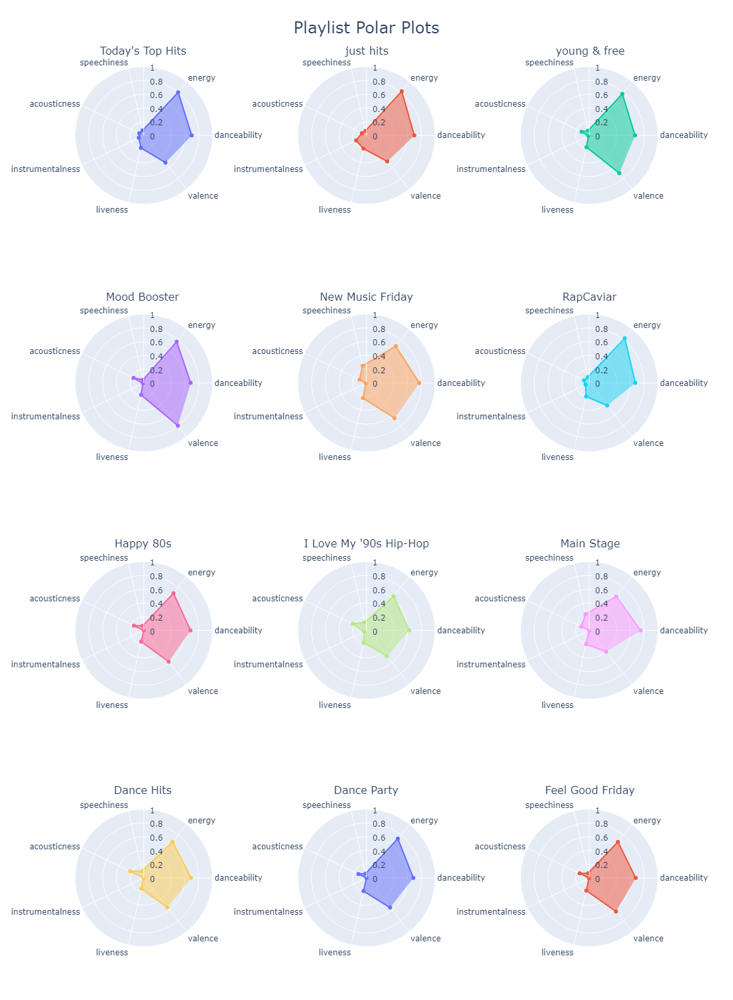

# Spotify Playlist Analyzer
**Analysis of Spotify's Featured Playlists**

I used a Jupyter notebook to analyze the characteristics of each playlist based off the cumulative data of their individual tracks.
- Collect top 12 featured playlist IDs
- Gather all tracks in each playlist
- Gather all track information
- Gather all information collected thusfar into a single dataframe
- Adjust datatypes of columns with incorrect datatypes
- Export dataframe to CSV for future further data analysis
- Gather all track information by playlist and add to its own dataframe
- Add a column for a more readable time of each playlist (changed duration in milliseconds to a hh:mm:ss format as a string)
- Export new dataframe to CSV for future further data analysis
- Heatmap of the correlation coefficients between all the stats (image below)
- Setup KDE plot data for the most positive, most negative, and closest to zero correlation pairs accross all playlists
- Plot the info from the setups above (images below)
- Make polar scatterplots of the data by playlist (image below)

*Analysis ran on 15 July 2022*